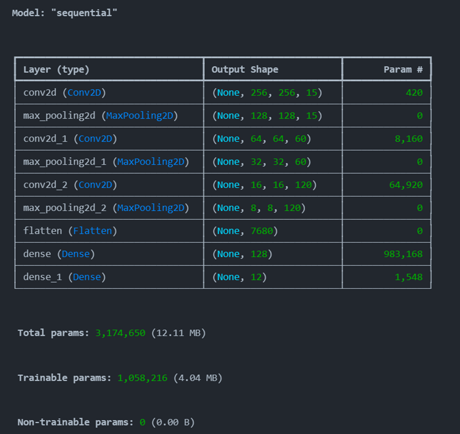
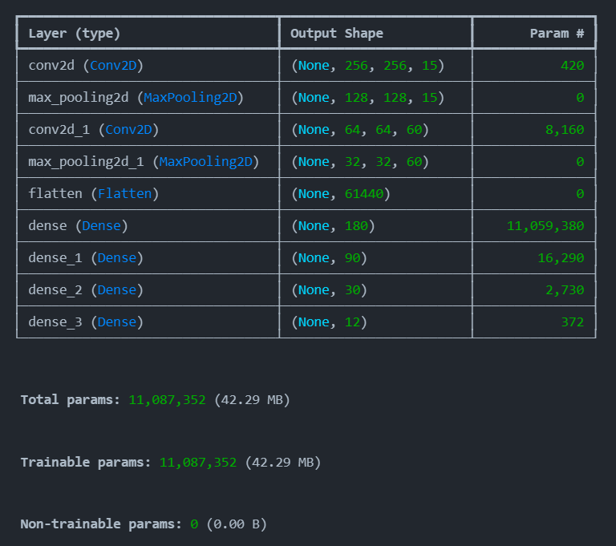
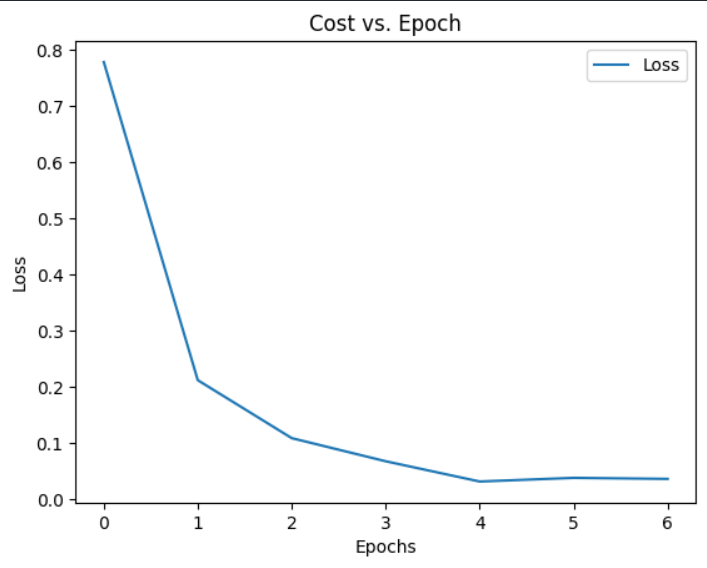

# Convolutional Neural Netwrok
## Lord of the Strides
## Description
It's that time of the year again, Timothy is excited to see the bunch that has made it to the final task in the preliminary Taskphase and 

is throwing a party to his fellow friends(the descendants of those whose teeth you classified). But he needs help feeding the right kind of

stuff to the right dino, can you help him out?

## Implementation

Build a CNN to predict which class the image from the dataset belongs to.

You are allowed to use torch/tensorflow-keras to build the model, no pretrained models are allowed though.

Timothy is a visual learner, so he needs to see visualizations like confusion matrices, predictions, and graphs before he can trust your code.

## Documentation
### CNN model 1.0


This approach contained 3 layers of Convolution and max pooling with increasing filters. Later on there was only one dense layer, before 

the output layer with the softmax function. All the other layers used ReLu activation function.
### Accessing performance
Even though the epoch seems to decrease, the validation accuracy shows overfitting. This can be seen as over 15 epochs the accuracy of the 
training data reached 99%, but accuracy of the test data is 68%.

### Notes for model 2.0
Increase the  layers in dense layers, gradually decrease it to no of categories.
Adding callback parameter, to track accuracy and not let it exceed too much, avoiding overfitting.

### Observation
I expected vacation photos having the most miss-classified data points, but the confusion matrix shows there was more misclassification among similar looking leaves like the apple and peach.

### CNN model 2.0



This model has 2 pairs of convolutional layers and 4 dense layers. To prevent overfitting, I added 

```early_stopping = EarlyStopping(monitor='val_accuracy',patience=2,restore_best_weights=True )```

This line helps to monitor train accuracy, if high over 2 consequitive eopch, it stops learning. 

This helps overfitting and epoch can be kept bigger as this line will terminate it if overfitting.
### Accessing performance
The accuracy increases a bit. The learning terminates at epoch 6 at 99.43% accuracy for train. More optimization can be done, to get better performance over test data. 

Droupout can be used to regularise the deeplayers, decreasig overfitting.



Accuracy = 0.6984323432343235

F1 = 0.6837288752734939

Recall = 0.7163465228576875

Precision = 0.7189334474141753
